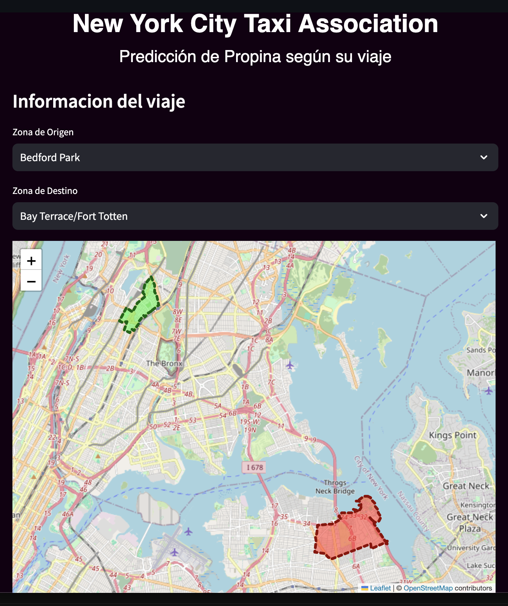

# Clasificación de Propinas en Viajes de Taxi 🚖💸



Este proyecto utiliza un modelo de machine learning para predecir si un pasajero dejará una buena propina en un viaje de taxi, basado en características como el día de la semana, la distancia del viaje, la duración, y otros datos.

## Estructura del Proyecto

Este proyecto está dividido en varios componentes principales, organizados en diferentes directorios:

    ```plaintext
    TAREA3/
    ├── .venv/
    ├── backend/
    │   ├── __pycache__/
    │   └── server.py
    ├── frontend/
    │   ├── __pycache__/
    │   └── client.py
    ├── model/
    │   ├── random_forest.joblib
    │   ├── random_forest.pkl
    │   ├── train.ipynb
    │   └── yellow_tripdata_2020-01.parquet
    ├── taxi_zones/
    │   ├── taxi_zone_lookup.csv
    │   ├── taxi_zones.dbf
    │   ├── taxi_zones.ipynb
    │   ├── taxi_zones.prj
    │   ├── taxi_zones.sbn
    │   ├── taxi_zones.sbx
    │   ├── taxi_zones.shp
    │   ├── taxi_zones.shp.xml
    │   └── taxi_zones.shx
    ├── .gitignore
    ├── LICENSE
    ├── README.md
    └── requirements.txt

## Descripción de los Directorios y Archivos

backend/: Contiene los archivos relacionados con el backend del proyecto.

server.py: Script principal del servidor backend.
frontend/: Contiene los archivos relacionados con el frontend del proyecto.

client.py: Script principal del cliente frontend.
client copy.py: Copia de seguridad del archivo client.py.
model/: Contiene los archivos relacionados con el modelo de Machine Learning.

random_forest.joblib: Modelo Random Forest serializado en formato joblib.
random_forest.pkl: Modelo Random Forest serializado en formato pickle.
train.ipynb: Notebook Jupyter utilizado para entrenar el modelo.
yellow_tripdata_2020-01.parquet: Datos de entrenamiento en formato Parquet.
taxi_zones/: Contiene los archivos relacionados con las zonas de taxis en NYC.

taxi_zone_lookup.csv: Archivo CSV que contiene la información de las zonas de taxis.
taxi_zones.shp: Shapefile principal que define las zonas de taxis.
taxi_zones.ipynb: Notebook Jupyter para trabajar con las zonas de taxis.
Otros archivos (.dbf, .prj, .sbn, .sbx, .shp.xml, .shx): Archivos complementarios para el shapefile.
.venv/: Entorno virtual de Python para el proyecto.

.gitignore: Archivo que define qué archivos o directorios deben ser ignorados por Git.

LICENSE: Archivo de licencia del proyecto.

README.md: Este archivo, que contiene la descripción y la estructura del proyecto.

requirements.txt: Lista de dependencias de Python necesarias para el proyecto.
    
## Requisitos previos

- **Python 3.8+**
- **Streamlit** (Para la interfaz de usuario)
- [VS Code](https://code.visualstudio.com/) (opcional pero recomendado)
- [Modal](https://modal.com/) (para desplegar la API)

## Instalación

Sigue los pasos a continuación para configurar el entorno de desarrollo:

1. **Clonar o descargar el proyecto**  
   Desde tu terminal, clona el repositorio o descarga el proyecto.

2. **Crear un entorno virtual**  
   Abre VS Code y navega a la carpeta del proyecto. Luego, en la terminal, ejecuta los siguientes comandos:

   ```bash
   python3 -m venv .venv
   source .venv/Scripts/activate

3. **Instalar dependencias**
   Asegúrate de tener pip actualizado e instala las dependencias:
   ```bash
   pip install --upgrade pip
   pip install -r ./requirements.txt

## Despliegue
Sigue los pasos a continuación para desplegar la API y configurar la aplicación de Streamlit:

1. **Obtener un token de acceso a Modal**
    Ejecuta el siguiente comando en la terminal para autenticarte en Modal:
    ```bash
    modal token new

2. **Desplegar la API en Modal**
    Publica la API en Modal ejecutando el siguiente comando desde el terminal:
    ```bash
    modal deploy ./backend/server.py

3. **Configurar el endpoint de la API**
    Después de desplegar la API, obtén tu endpoint único (reemplaza {{tu usuario}} con tu nombre de usuario):
    ```python
    https://{{tu usuario}}--nyc-taxi-tip-prediction-fastapi-app.modal.run

4. **Actualizar el archivo client.py**
    Abre el archivo client.py y reemplaza la línea donde se define el endpoint:
    ```python
    endpoint = "{{pegar}}/predict"

Reemplaza {{pegar}} con tu endpoint de Modal.

5. **Iniciar la aplicación Streamlit**
    Finalmente, ejecuta la aplicación de Streamlit con el siguiente comando:
    ```bash
    streamlit run ./frontend/client.py# Tarea3
